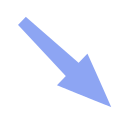
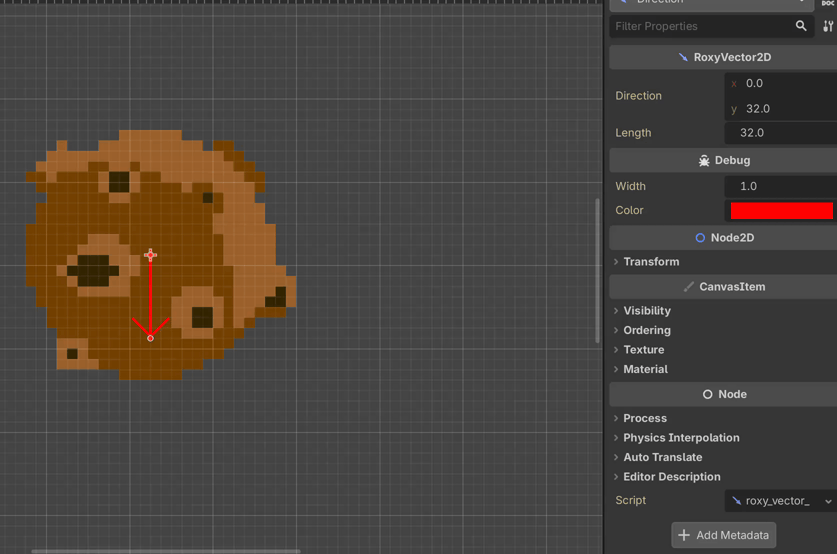

#  RoxyVector2D

A visual vector2 that can be edited in 2D editor. It consists of an *origin* (the Node2D position) and a *direction*.

Alternatively you can use *length* to set the length of the vector without change the direction.

## Debug

The "Debug" section in inspector allow you to change the appearence of the arrow. Use *ctrl/cmd* when drag arrow to snap moving on 4px grid (see limitations section).

The arrow displaying can be enable in-game when the Godot native "Visible paths" debug option is checked.

## Troubleshooting

Due to current Godot plugin's limitations to access to the editor, some issues are known:

- Arrows manipulation from 2D editors ignore current selection mode (move, rotate, scaling) because I need to overrides all the logic in plugin and there is currently no way to know current selection mode.
- Grid snap settings don't affect the arrow because I cannot, currently, access to your grid snap settings. When use *ctrl/cmd* during moving arrow, it snaps to a fixed grid (4px).

## License

Copyright 2026 Roxy Roocky

This plugin is licensed under **Apache 2.0** — here's what that means in plain English:

- ✅ You can use it in your projects, including commercial ones
- ✅ You can modify it and redistribute it
- ✅ You can integrate it into a closed source project
- ⚠️ You must keep the original copyright notice in your license files
- ⚠️ If you redistribute a modified version, you must state that changes were made

In short: **do whatever you want with it, just keep my name (Roxy Roocky) in the legal credits 😊. Thanks 😘 !**

Full license text in LICENSE file or here: [Apache License 2.0](https://www.apache.org/licenses/LICENSE-2.0)

